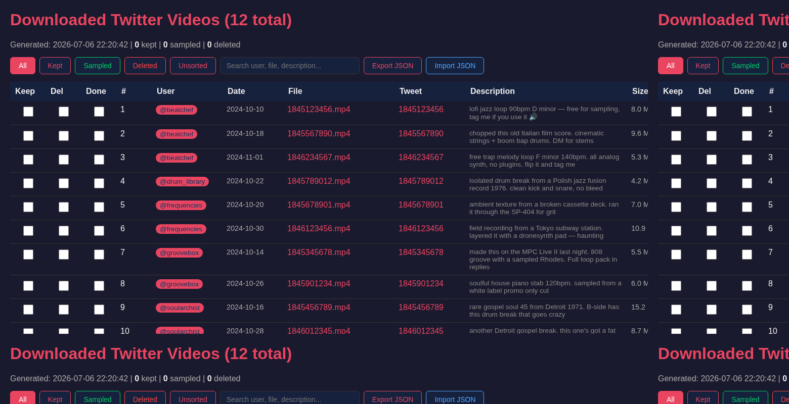

# Beat Digger X 🎧⛏️

[](https://www.python.org/downloads/)
[](https://opensource.org/licenses/MIT)

A complete toolkit to mass-download videos from your Twitter/X bookmarks, extract the audio, and browse them through an interactive, sortable HTML catalog designed for music producers and sample diggers.

Originally built for sampling into hardware like the **Akai MPC**, it preserves the original video files while providing workflow tools to tag, sort, and manage your collection.



---

## ✨ Features

- **Direct Bookmark Scraping**: Uses `gallery-dl` to download all videos from your private Twitter bookmarks in one go.
- **Audio Extraction**: Converts video audio to high-quality 320kbps MP3 (or preferred format) for easy loading into samplers.
- **Interactive HTML Catalog**: Generates a sleek, dark-mode web page to browse your downloads.
  - Keep / Delete / Sampled checkboxes with mutual exclusion.
  - Clickable links to original tweets and local video files.
  - Real-time search, column sorting, and drag-and-drop column reordering.
  - Resizable columns and sticky headers.
  - Import/Export your tags and comments via JSON.
- **Video Deletion**: Mark videos for deletion in the catalog UI, then run a script to permanently remove them from disk — including metadata sidecars, extracted MP3s, and empty folders.
- **Bookmark Management**: Generate a cross-reference CSV of downloaded tweets and optionally clear them from your Twitter account.
- **Safe Resumption**: Checkpointing and file-skip logic allow you to stop and resume downloads without losing progress.
- **Download Archive**: A SQLite-based archive tracks every downloaded video so deleted videos are never re-downloaded on subsequent scrapes.
- **Unified CLI**: A single `beat_digger.py` entry point with subcommands (`scrape`, `mp3`, `catalog`, `delete`, `clear`, `archive`, `status`, `all`) wraps all scripts into one streamlined workflow.

---

## 📦 Installation

### Prerequisites

| Tool | Install Command / Link |
|------|-----------------------|
| **Python 3.8+** | [python.org](https://python.org) |
| **FFmpeg** | macOS: `brew install ffmpeg` • Linux: `sudo apt install ffmpeg` |

### Setup

```bash
# Clone the repo
git clone https://github.com/vesahc/beat-digger-x.git
cd beat-digger-x

# Create and activate a virtual environment (recommended)
python3 -m venv venv
source venv/bin/activate  # On Windows: venv\Scripts\activate

# Install dependencies
pip install -r requirements.txt
```

---

## 🚀 Quick Start (CLI)

### 1. Export Cookies
Twitter bookmarks are private. You need to authenticate with cookies.

1. Install the [Get cookies.txt Locally](https://chromewebstore.google.com/detail/get-cookiestxt-locally/cclelndahbckbenkjhflpdbgdldlbecc) Chrome extension.
2. Log into `x.com` in your browser.
3. Click the extension and export cookies for the current domain.
4. Save the file as `cookies.txt` in the project directory.
5. Secure it: `chmod 600 cookies.txt`

### 2. Run the Pipeline

All commands use the unified CLI `beat_digger.py`:

```bash
# Download new videos from your bookmarks
python3 beat_digger.py scrape

# Extract audio (320kbps MP3 for MPC)
python3 beat_digger.py mp3

# Generate HTML catalog and open it in your browser
python3 beat_digger.py catalog --open
```

#### All Commands

| Command | Description |
|---------|-------------|
| `scrape` | Download new videos from Twitter bookmarks |
| `scrape --rescrape` | Force fresh download (ignores existing files) |
| `scrape --extract-audio` | Download + extract MP3 in one step |
| `mp3` | Extract audio from downloaded videos |
| `catalog` | Generate the interactive HTML catalog |
| `catalog --open` | Generate catalog and open in browser |
| `delete` | Delete videos marked in catalog, then auto-regenerate |
| `delete --dry-run` | Preview deletions without making changes |
| `clear` | Clear bookmarks from Twitter (manual browser mode) |
| `archive` | One-time backfill for existing installs |
| `status` | Show collection statistics and suggestions |
| `all` | Full pipeline: scrape → mp3 → catalog |
| `all --open` | Pipeline + open catalog in browser |

#### Typical Workflow

```bash
# First time: scrape, extract audio, and open catalog
python3 beat_digger.py all --open

# Later: just grab new bookmarks
python3 beat_digger.py scrape --extract-audio
python3 beat_digger.py catalog --open

# Check what you have
python3 beat_digger.py status
```

> **Existing install?** If you have videos from before the archive feature, run `python3 beat_digger.py archive` once after your first scrape. Fresh installs can skip this — the archive is created and maintained automatically.

---

## 📖 Individual Scripts

Prefer running scripts directly? All scripts work standalone.

| Script | CLI equivalent | Description |
|--------|---------------|-------------|
| `scrape_bookmarks.py` | `scrape` | Download bookmarked videos via gallery-dl. Pass `--rescrape` to force fresh download. |
| `extract_audio.py` | `mp3` | Extract 320kbps MP3 audio from downloaded videos. Also generates `to_unbookmark.csv`. |
| `list_videos.py` | `catalog` | Generate the interactive HTML catalog (`video_list.html`). |
| `delete_videos.py` | `delete` | Delete videos marked in the catalog, add to archive. Use `--dry-run` to preview. |
| `clear_bookmarks.py` | `clear` | Open tweet URLs in browser batches for manual unbookmarking. |
| `init_archive.py` | `archive` | One-time backfill for pre-archive installs. Fresh installs skip this. |

> **Deleting videos:** In the HTML catalog, check the **Del** checkbox on videos you want to remove, click **Export JSON**, then run `delete_videos.py` (or `beat_digger.py delete`). Deleted videos are archived so they won't re-download on future scrapes.

---

## 🔐 Security & Risk Notes

- **Treat `cookies.txt` like a password.** It grants full access to your account. It is included in `.gitignore` and should never be committed.
- **Ban Risk**: Scraping private bookmarks violates Twitter's ToS. This tool includes rate-limiting, but there is always a risk of temporary account locks. Use at your own discretion.

---

## 📜 License

Distributed under the MIT License. See `LICENSE` for more information.
